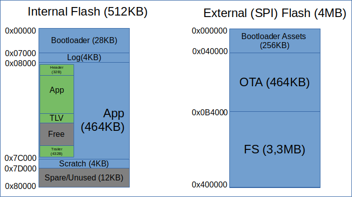
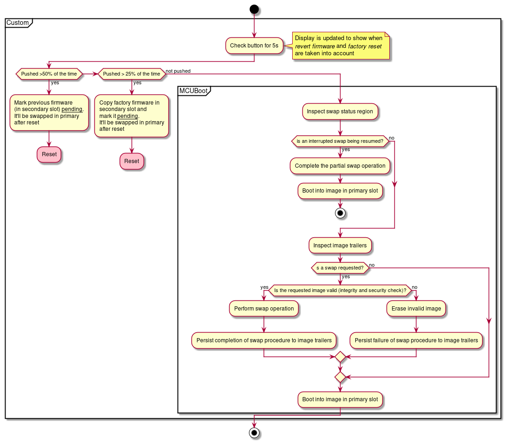
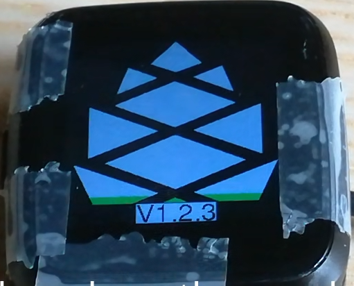
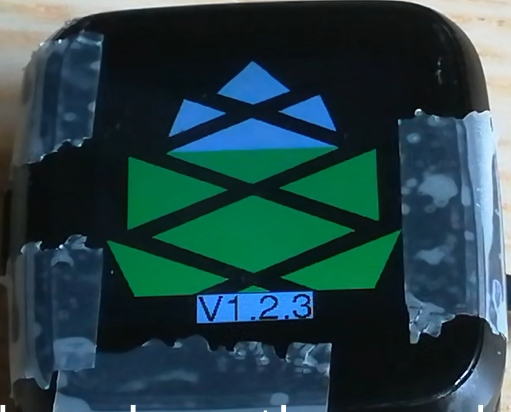
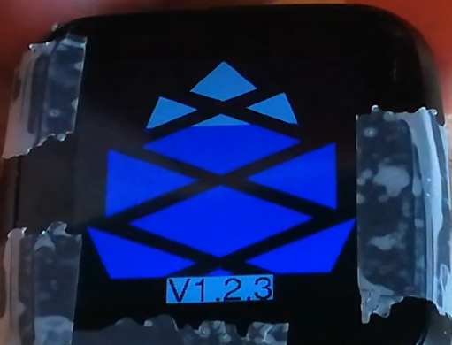
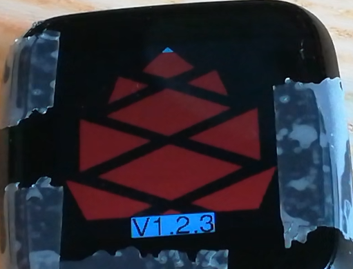
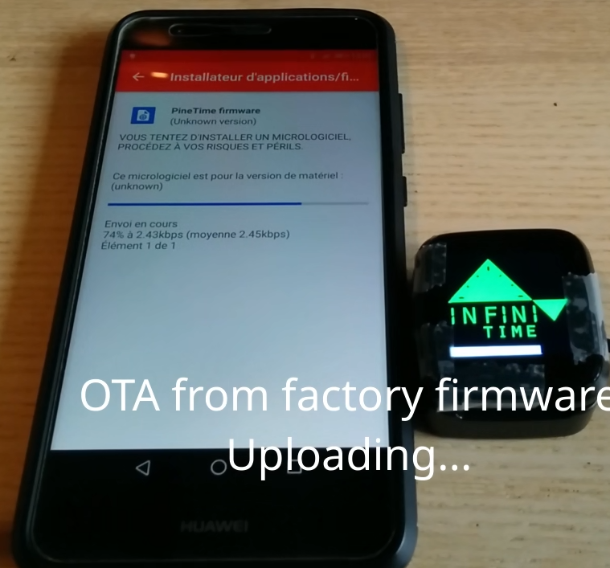

# PineTime MCUBoot bootloader
An open source bootloader for the PineTime based on MyNEWT and MCUBoot.

## About this project
This repo is based on [Lupyuen's](https://github.com/lupyuen) [amazing work](https://github.com/lupyuen/pinetime-rust-mynewt).

Lup is the very first developer to have dared to build a bootloader for the PineTime. And it was a success as [version 4.1.7](https://github.com/lupyuen/pinetime-rust-mynewt/releases/tag/v4.1.7) was preloaded in the new batch of PineTime devkits in September 2020.

Lup uses [his repo](https://github.com/lupyuen/pinetime-rust-mynewt) to conduct many experiments (Rust firmware, mynewt, lvgl,...). In this the, the code of the bootloader was mixed with a lot of other code, and the history was not easy to read.

That's why I decided (with his agreement) to extract the bootloader code into a shiny new project. This will ease the code readability and its maintenance.

Changes between the original repo and the "Initial commit" of this one can be seen in this fork : https://github.com/JF002/pinetime-rust-mynewt/tree/restore-factory-image.

## Features

- Start the **application** firmware
- Provide a safe and efficient way to **swap firmwares** from the secondary slot (in external flash memory) and the primary slot (in internal flash memory), thanks to MCUBoot
- **Revert** to the previous version of the firmware
- Load and run a **recovery** firmware
- Basic UI (logo, progress bar, button)

## Memory map

The PineTime is based on 2 flash memories:
- **The internal flash** (512KB) : this flash is integrated into the MCU. The MCU runs the code from this memory. It cannot run codes directly from the external SPI flash memory. This internal memory contains the bootloader code as well as the application firmware. The scratch area is used by MCUBoot to swap firmwares from internal and external memories.
- **The external** flash (4MB) : this memory is external to the MCU and is connected to the MCU using an SPI bus. It contains the recovery firmware (in the section *Bootloader Assets*) and the secondary slot for MCUBoot (*OTA section*). The *FS* part is available for the application firmware.

## Boot flow

The bootloader is the first piece of software that is running on the PineTime. It's main goal is to load the application firmware. It is also responsible to swap the firmware from the secondary and primary slot if a newer version of the firmware is present in the secondary slot. It also provides the possibility to revert to the previous version of the firmware and to restore a recovery firmware that supports OTA.

At startup, the bootloader displays a **logo and its version**:

Then, it waits for ~5s in case the user presses the button. The **progress** is shown by the color of the logo.

When the user just wants to **run the current firmware**, they won't touch the button, and the logo will be filled in **green**:

When the timeout is elapsed, **MCUBoot** will be run. It'll swap the firmware if needed and then run the firmware from the primary slot.

If the user presses the button until the logo is drawn in **blue**, the previous version of the firmware will be **reverted**:

If the user presses the button longer, until the logo is drawn in **red**, the **recovery** firmware will be loaded into the primary slot and will be run after the next reset:

## Recovery firmware

The recovery firmware is a "lightweight" version of InfiniTime. It is stripped of most of its functionalities : it only provides **basic UI, BLE connectivity and OTA**.

The goal of this firmware is to provide a mean for the user to OTA a new firmware in case the current firmware does not work properly or does not provide OTA.

## How to build

- Install `newt` tool
- Clone the project and `cd` into it
- Init and update submodules : `git submodule update --init --recursive`
- Configure mynewt : `newt upgrade`
- Build : `scripts/nrf52/build-boot.sh`. The firmware is generated in `bin/targets/pinetime/app/@mcuboot/boot/mynewt/mynewt.elf` and the DFU file for the reloader : `reloader/build-pinetime/reloader-mcuboot.zip`

You can also build the firmware for the P8 watch, which has a slightly different pin mapping. The `build-boot.sh` accepts an optional argument (default: `pinetime`, options: `pinetime`, `p8`) to specify the target to build.

- Build : `scripts/nrf52/build-boot.sh p8`. The firmware is generated in `bin/targets/p8/app/@mcuboot/boot/mynewt/mynewt.elf` and the DFU file for the reloader : `reloader/build-p8/reloader-mcuboot.zip`

## About the code

This project is based on MyNEWT RTOS and MCUBoot bootloader. The specific code for the PineTime is located in `libs/pinetime_boot`.

